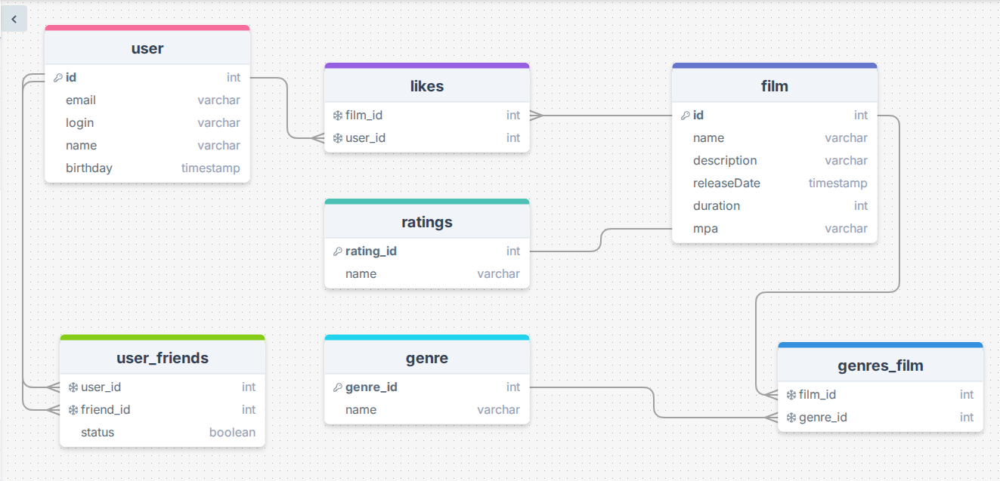

<!-- -*- coding: utf-8 -*- -->
# java-filmorate
Template repository for Filmorate project.

## Примеры SQL-запросов

Ниже приведены основные запросы к базе данных проекта.
-- Получить все фильмы

-- Получить все фильмы
SELECT * FROM films;

-- Найти фильмы по жанру (например, 'Комедия')
SELECT f.* 
FROM film f
JOIN genres_film fg ON id = fg.film_id
JOIN genre g ON fg.genre_id = g.genre_id
WHERE g.name = 'Комедия';

